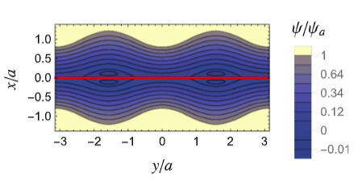
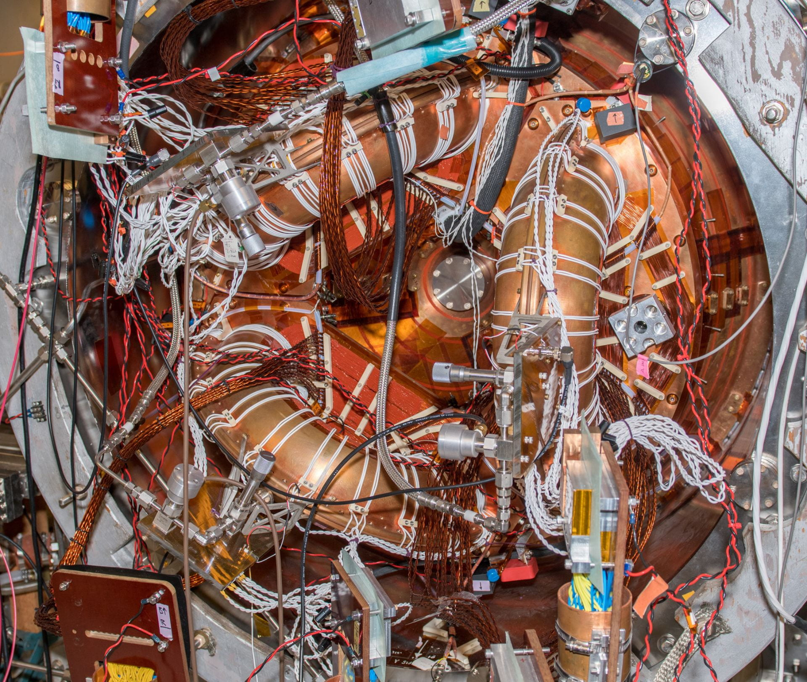
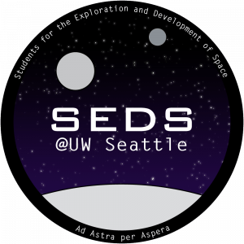

### Abstract

Here is a little more surrounding my interests. Many of them have lengthy acronyms.

## 1. PPPL (Jun 2022 - Present)

<aside>

   
   <figcaption> Fig. 1: Hahm-Kulsrud Slab Magnetic Flux with rippled boundaries [[2](#2)].</figcaption>

</aside>

**Stands for:** Princeton Plasma Physics Laboratory

PPPL is one of the leading national laboratories researching plasma physics for fusion energy and astrophysics. I work with the PPPL Theory Department to research Magnetohydrodynamics (MHD) models under the mentorship of Dr. Adelle Wright and Dr. Benjamin Faber (@ the University of Wisconsin, Madison.) My research has been based on approaches to modelling plasma structures that form in Tokamak and Stellarator reactor plasmas. Approaches include analytical and numerical methods using Trixi.jl, a numerical solver code written in Julia [[1](#1)].

 
 
 
 

## 2. AUEG (Nov 2020 - Present)

<aside>

   
   <figcaption> Fig. 2: Dome of the Manastash Ridge Observatory.</figcaption>

</aside>

**Stands for:** Astronomy Undergraduate Engineering Group

AUEG is a student organization within the Astronomy department centering on designing instrumentation used at the Manastash Ridge Observatory [[3](#3)]. I currently work as vice president and one of the software project leads under the mentorship of Professors Oliver Fraser and José Sánchez-Gallego. Projects include telescope camera software for ASTR 481 (undergraduate capstone astronomy course), and sensors for weather, air quality, and rainwater collection.

 
 
 
 

## 3. HIT-SI Experiment (Jun 2021 - Feb 2023)

<aside>

   
   <figcaption> Fig. 3: HIT Experiment Reactor.</figcaption>

</aside>

**Stands for:** Helicity Injection Torus, Steady Inductive

The HIT-SI experiment researched the "spheromak" reactor concept under the A&A department [[4](#4)]. I worked as a student assistant under the mentorship of Dr. Chris Hansen, Dr. Aaron Hossack, and Dr. Kyle Morgan. I helped with CAD modeling and assembly of the experiment and porting magnetic probe signal code from MATLAB to Python.

 
 
 
 

## 3. SEDS (Jan 2021 - Aug 2021)

<aside>

   
   <figcaption> Fig. 4: SEDS Logo.</figcaption>

</aside>

**Stands for:** Students for the Exploration and Development of Space

SEDS is a student organization the A&A department [[5](#5)]. The club hosts projects and research on a wide variety of topics
in A&A, such as multi-stage rocket design, plasma sails, and space policy. As of now, I manage a project paper subgroup within SEDS for the competition SEDS-SSPI (Space & Satellite Professionals International). The paper centers on manufacturing and industry in space (i.e. mining asteroids).

## References

[1]    [Trixi.jl](https://trixi-framework.github.io/)

[2]    [Dewar et al. (2017)](https://doi.org/10.1063/1.4979350)

[3]    [MRO](https://sites.google.com/a/uw.edu/mro/)

[4]    [HIT-SI Lab](https://sites.uw.edu/hitsilab/)

[5]    [SEDS](https://sites.uw.edu/seds/)

